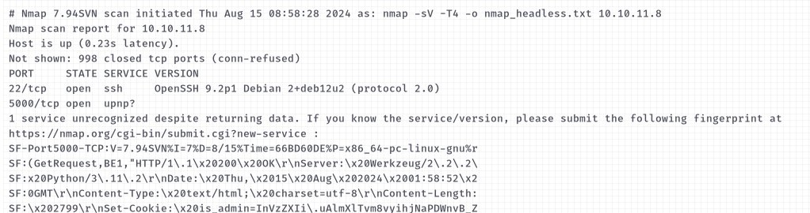

IP: 10.10.11.8
- Scan nmap: nmap -sV -T4 10.10.11.8

- Có 2 cổng mở cổng 22 cho ssh và cổng 5000 cho upnp?
- ở đây ta không biết username ssh là gì nên thử truy cập vào http://10.10.11.8:5000/

- Nhấp for questions 

- Ra 1 form nhập thông tin liên hệ, nhìn đề bài cho thông tin về lỗ hổng xss.

- Không chèn được script lên url, loại bỏ khả năng reflected xss, có 1 form nhập bình luận khả năng cao là stored xss.
- chèn thử 1 đoạn script và form 
 
 