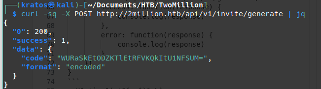
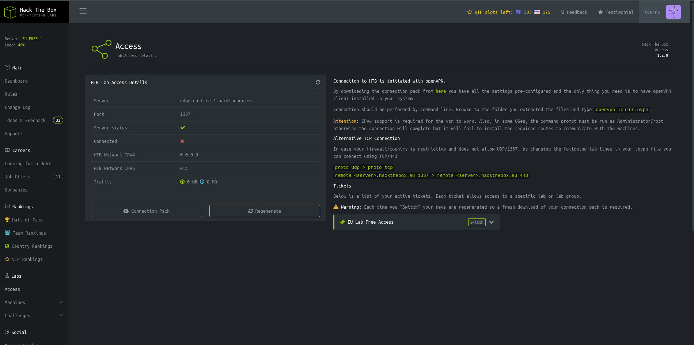
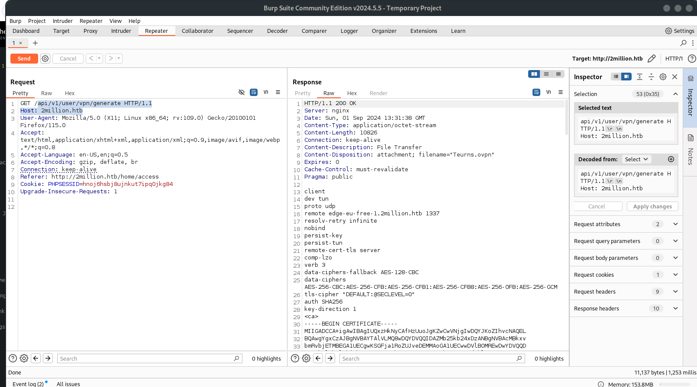
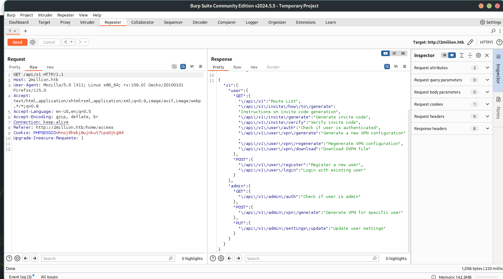
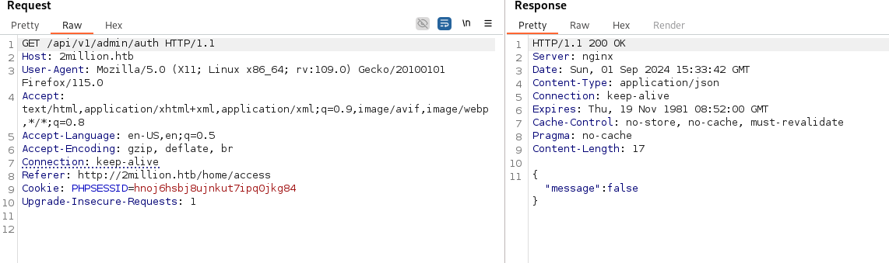
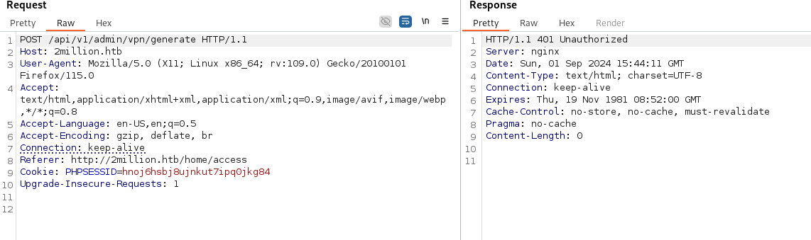
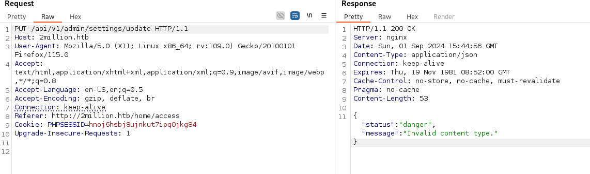
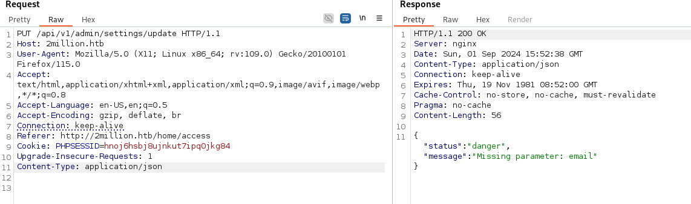
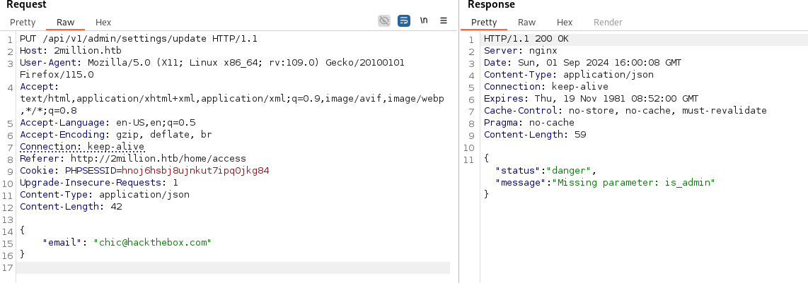

IP: 10.10.11.221
- Scan nmap: nmap -sC -sV T4 10.10.11.221

- có 2 cổng tcp mở
    - cổng tcp 22 cho  dịch vụ ssh
    - cổng tcp 80 cho dịch vụ http

- như bao nền tảng khác, cần login để truy cập dịch vụ, không có toàn khoản. 
- lướt xuống sẽ thấy phần để đăng kí

- giao diện cụ thể sẽ như này. Có 2 tệp js, 1 tệp font end => bỏ qua đi, file thứ 2 thấy có hàm eval. eval là hàm global để thực thi mã (bất cấp là không an toàn và không đọc được).

```
eval(function(p, a, c, k, e, d) {
    e = function(c) {
        return c.toString(36)
    }
    ;
    if (!''.replace(/^/, String)) {
        while (c--) {
            d[c.toString(a)] = k[c] || c.toString(a)
        }
        k = [function(e) {
            return d[e]
        }
        ];
        e = function() {
            return '\\w+'
        }
        ;
        c = 1
    }
    ;while (c--) {
        if (k[c]) {
            p = p.replace(new RegExp('\\b' + e(c) + '\\b','g'), k[c])
        }
    }
    return p
}('1 i(4){h 8={"4":4};$.9({a:"7",5:"6",g:8,b:\'/d/e/n\',c:1(0){3.2(0)},f:1(0){3.2(0)}})}1 j(){$.9({a:"7",5:"6",b:\'/d/e/k/l/m\',c:1(0){3.2(0)},f:1(0){3.2(0)}})}', 24, 24, 'response|function|log|console|code|dataType|json|POST|formData|ajax|type|url|success|api/v1|invite|error|data|var|verifyInviteCode|makeInviteCode|how|to|generate|verify'.split('|'), 0, {}))
```
- Đi decode ra được
```
function verifyInviteCode(code) {
    var formData = {
        "code": code
    };
    $.ajax({
        type: "POST",
        dataType: "json",
        data: formData,
        url: '/api/v1/invite/verify',
        success: function(response) {
            console.log(response)
        },
        error: function(response) {
            console.log(response)
        }
    })
}

function makeInviteCode() {
    $.ajax({
        type: "POST",
        dataType: "json",
        url: '/api/v1/invite/how/to/generate',
        success: function(response) {
            console.log(response)
        },
        error: function(response) {
            console.log(response)
        }
    })
}
```
- Mô tả vắn tắt về 2 hàm: 
    - hàm verifyInviteCode(code) xác thực mã code được gửi đến "/api/v1/invite/verify"  để xác thực sau đó phản hổi
    - hàm makeInviteCode() gọi đến '/api/v1/invite/how/to/generate' để tạo code.
- Ta sẽ gửi http post đến url: /api/v1/invite/verify để gen code.
```
curl -sq -X POST http://2million.htb/api/v1/invite/generate | jq 
```

- Bị mã hóa base 64, decode ra: YDZJA-86JNQ-DUJBB-SSEIC

- sau khi nhập mã mời được 1 form như này
```
email: chic@hackthebox.com
password:123
```
- Sau khi đã tạo tài khoản xong, login vào 

- ở phần bên dưới lab/access

- Sau khi ấn vào connection pack, 1 file vpn sẽ được tải xuống để người dùng kết nối tới nền tảng.

- Kết nối tới /api/v1/user/vpn/generate để gen ra vpn

- /api/v1 sẽ có mô tả về full api 
```
{
  "v1": { 
    "user": {
      "GET": {
        "/api/v1": "Route List",  
        "/api/v1/invite/how/to/generate": "Instructions on invite code generation", 
        "/api/v1/invite/generate": "Generate invite code",
        "/api/v1/invite/verify": "Verify invite code",
        "/api/v1/user/auth": "Check if user is authenticated",
        "/api/v1/user/vpn/generate": "Generate a new VPN configuration",
        "/api/v1/user/vpn/regenerate": "Regenerate VPN configuration",
        "/api/v1/user/vpn/download": "Download OVPN file"
      },
      "POST": {
        "/api/v1/user/register": "Register a new user",
        "/api/v1/user/login": "Login with existing user"
      }
    },
    "admin": {
      "GET": {
        "/api/v1/admin/auth": "Check if user is admin"
      },
      "POST": {
        "/api/v1/admin/vpn/generate": "Generate VPN for specific user"
      },
      "PUT": {
        "/api/v1/admin/settings/update": "Update user settings"
      }
    }
  }
}
```
- Thử truy cập vào: /api/v1/admin/auth xem có được không, khả năng là không được vì không có tài khoản admin.

- Tiếp tục thử truy cập: /api/v1/admin/vpn/generate

- Cuối cùng đến: /api/v1/admin/settings/update

- thay vì mã lỗi 401 thì đã thành 200 truy cập được, thường thường APIs sử dụng JSON.
- Bây giờ ta nhập thử  Content-Type: application/json vào trong request xem 
 
- Ta thêm trường email: chic@hackthebox.com

